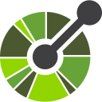

<div style="background-color: black; color: white; padding: 20px; border-radius: 10px;">

<div align="right">
    <a href="https://user-badge.committers.top/kazakhstan/s-rb">
        
    </a>
</div>
<div align="center">
     
     
    
    
</div>


<h1 align="center">
  <a href="https://surkoff.com">
    
  </a>
</h1>


<p align="center">
    👨🏻‍💻 Hi! I am <b>Roman Surkoff</b>, an experienced <b>software engineer</b>, who likes to explore new technologies, develop software solutions and quick hacks
    <br>
    🌱 I’m currently Working on Fintech Backends
    <br>
    🤝 I’m available for hire/freelancing.
    <br>
    💬 Ask me about <b>Java & Spring</b>
</p>


<p align="center">
    
</p>
<br>


<h2 align="center">🛠 Tech Stack</h2>
<h3 align="center">Primary: </h3>
<div align="center">
<a href="https://github.com" target="_blank"> 
     </a>
<a href="https://www.spring.io/" target="_blank" rel="noreferrer"> 
     </a>
<a href="https://git-scm.com/" target="_blank" rel="noreferrer"> 
     </a>
<a href="https://www.docker.com/" target="_blank" rel="noreferrer"> 
     </a>

<a href="https://www.linux.org/" target="_blank" rel="noreferrer"> 
     </a> 
<a href="https://www.mongodb.com/" target="_blank" rel="noreferrer"> 
     </a>
<a href="https://www.postgresql.org/" target="_blank" rel="noreferrer"> 
     </a>
<a href="https://kotlinlang.org" target="_blank" rel="noreferrer"> 
     </a>
<a href="https://www.elastic.co/kibana" target="_blank" rel="noreferrer"> 
     </a>
</div>
<br/>
<div align="center">
<details>
<summary>Secondary (click me!)</summary>
<div style="background-color: white; color: white; padding: 5px; border-radius: 2px;">
<a href="https://dbeaver.io/" target="_blank" rel="noreferrer"> 
     </a>
<a href="https://github.com/" target="_blank" rel="noreferrer"> 
     </a>
<a href="https://gradle.org/" target="_blank" rel="noreferrer"> 
     </a> 
<a href="https://hibernate.org/" target="_blank" rel="noreferrer"> 
     </a>  
<a href="https://www.jetbrains.com/idea/" target="_blank" rel="noreferrer"> 
     </a>  
    
   
<a href="https://junit.org" target="_blank" rel="noreferrer"> 
     </a>  
<a href="https://liquibase.com" target="_blank" rel="noreferrer"> 
     </a>  
<a href="https://maven.apache.org" target="_blank" rel="noreferrer"> 
     </a> 
   
<a href="https://kafka.apache.org/" target="_blank" rel="noreferrer"> 
     </a> 
<a href="https://www.elastic.co" target="_blank" rel="noreferrer"> 
     </a>
</div>
</details>
</div>
<div align="center">
<details>
<summary>Other tools and languages (click me!)</summary>
<div style="background-color: white; color: white; padding: 5px; border-radius: 2px;">
<a href="https://www.python.org" target="_blank" rel="noreferrer"> 
     </a>
<a href="https://developer.mozilla.org/en-US/docs/Web/JavaScript" target="_blank" rel="noreferrer"> 
     </a>

<a href="https://www.rabbitmq.com" target="_blank" rel="noreferrer"> 
     </a>
<a href="https://ubuntu.com/" target="_blank" rel="noreferrer"> 
     </a>
<a href="https://react.dev" target="_blank" rel="noreferrer"> 
     </a>  
<a href="https://nodejs.org" target="_blank" rel="noreferrer"> 
     </a>  


<a href="https://gitlab.com/" target="_blank" rel="noreferrer"> 
     </a> 
<a href="https://www.jenkins.io/" target="_blank" rel="noreferrer"> 
     </a>  
<a href="https://www.atlassian.com/software/jira" target="_blank" rel="noreferrer"> 
     </a>  
   
   
<a href="https://notion.so" target="_blank" rel="noreferrer"> 
     </a>  

<a href="https://openapis.org" target="_blank" rel="noreferrer"> 
     </a>  
<a href="https://selenium.dev" target="_blank" rel="noreferrer"> 
     </a>  
<a href="https://sonarsource.com" target="_blank" rel="noreferrer"> 
     </a>  
<a href="https://sourcetreeapp.com" target="_blank" rel="noreferrer"> 
     </a>
<a href="https://angular.dev" target="_blank" rel="noreferrer"> 
     </a>  
    
<a href="https://kubernetes.io" target="_blank" rel="noreferrer"> 
     </a> 
<a href="https://www.mysql.com/" target="_blank" rel="noreferrer"> 
     </a> 
<a href="https://www.nginx.com" target="_blank" rel="noreferrer"> 
     </a> 
<a href="https://redis.io" target="_blank" rel="noreferrer"> 
     </a>
<a href="https://bitbucket.org" target="_blank" rel="noreferrer"> 
     </a>
<a href="https://www.atlassian.com/software/confluence" target="_blank" rel="noreferrer"> 
     </a>
<a href="https://github.com/" target="_blank" rel="noreferrer"> 
     </a> 
<a href="https://code.visualstudio.com/" target="_blank"> 
     </a> 
<a href="https://obsidian.md/" target="_blank"> 
     </a> 
<a href="https://www.centos.org/" target="_blank"> 
     </a> 
<a href="https://postman.com" target="_blank" rel="noreferrer"> 
     </a> 
<a href="https://grafana.com" target="_blank" rel="noreferrer"> 
     </a>
</div>
</details>
</div>

<br/>
<p align=center>
  <div align=center></div>
</p>


<h2 align="center">👨‍💻Highlighted repos 👨‍💻</h2>
<div align="center">
<a align="center" href="./MY_PUBLIC.md" title="My projects">
    
</a>
<a align="center" href="./PRACTICE.md" title="Study and experiments repos">
    
</a>
<a align="center" href="./OPEN.md" title="Forked repos">
    
</a>
</div>
<div align="center">
    <a align="center" href="https://github.com/s-rb/keycloak-dockerized-ssl-nginx" title="Keycloak Docker Nginx SSL">
    </a>
    <a align="center" href="https://github.com/s-rb/blog-engine" title="Blog engine">
    </a>
    <a align="center" href="https://github.com/s-rb/portfolio-front" title="Portfolio Web site">
    </a>
    <a align="center" href="https://github.com/s-rb/site" title="Personal website">
    </a>
    <a align="center" href="https://github.com/s-rb/s-rb" title="Readme">
    </a>
</div>
<h3 align="center">
  <a href="https://github.com/s-rb?tab=repositories" title="Show Repositories">🔎 Show all 🔍</a>
</h3>
<h4 align="center">
  <a href="./Navigation.md" title="Show Repositories">🤝🏻&nbsp;Old projects navigation</a>
</h4>
<br>
<h2 align="center">⚡ Stats ⚡</h2>
<p align=center>
<div align=center>
<div>
<a href="https://github.com/s-rb"></a>
</div>
<div>
<a href="https://surkoff.com"></a>
</div>
</div>
</p>

📊 **This week i spent my time on:**
<!--START_SECTION:waka-->
```text
Other           12 hrs 33 mins  ███████████████░░░░░░░░░░░░░░░    49.00 %
Java            7 hrs 53 mins   ██████████░░░░░░░░░░░░░░░░░░░░    31.00 %
Kotlin          4 hrs 19 mins   ██████░░░░░░░░░░░░░░░░░░░░░░░░    17.00 %
YAML            15 mins         █░░░░░░░░░░░░░░░░░░░░░░░░░░░░░     1.00 %
Groovy          11 mins         █░░░░░░░░░░░░░░░░░░░░░░░░░░░░░     1.00 %
```
<!--END_SECTION:waka-->


<br/>

<h2 align="center" > Connect with me 🤝 </h2>
<p align="center">
    <div align="center"  class="icons-social" style="margin-left: 10px;">
        <a style="margin-left: 10px;"  target="_blank" href="https://surkoff.com">
            
        </a>
        <a style="margin-left: 10px;"  target="_blank" href="https://surkoff.su">
            
        </a>
        <a style="margin-left: 10px;"  target="_blank" href="mailto:surkoff.com@gmail.com">
            
        </a>
        <a style="margin-left: 10px;"  target="_blank" href="https://www.linkedin.com/in/roman-surkoff/">
            
        </a>
        <a style="margin-left: 10px;" target="_blank" href="https://github.com/s-rb">
            
        </a>
        <a style="margin-left: 10px;" target="_blank" href="https://leetcode.com/surkoff/">
            
        </a>
        <a style="margin-left: 10px;" target="_blank" href="https://github.com/s-rb/site/blob/master/assets/files/cv.pdf">
            
        </a>
    </div>
</p>
</div>


<!-- Resources -->
<!-- Icons: https://simpleicons.org/ -->
<!-- GitHub Stats: https://github.com/anuraghazra/github-readme-stats -->
<!-- Emojis: https://emojipedia.org/emoji/ -->
<!-- HTML Emojis: https://www.fileformat.info/index.htm -->
<!-- Shields: https://shields.io/ -->
<!-- Awesome GitHub Profile README: https://github.com/abhisheknaiidu/awesome-github-profile-readme -->
<!-- Awesome github profiles: 
https://github.com/coderjojo/creative-profile-readme 
https://dev.to/github/10-standout-github-profile-readmes-h2o
https://github.com/MaxRohowsky/best-github-profile-readme
https://github.com/logancyang/awesome-personal-websites
https://zzetao.github.io/awesome-github-profile/
https://github.com/pages-cms/pages-cms
portfolios - https://github.com/yousinix -->
